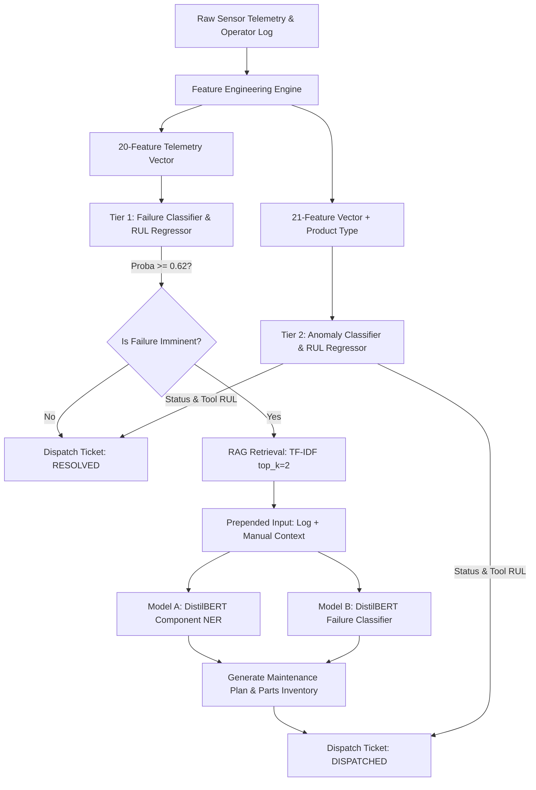

# ACME Industries — Predictive Maintenance System Architecture

This document describes the end-to-end software and machine learning architecture of the ACME Industries Predictive Maintenance System. The system employs a multi-tiered defense architecture combining telemetry failure predictions, supervised anomaly detection, remaining useful life (RUL) regression, and RAG-augmented NLP diagnostics.

---

## 1. System Topology & Data Flow

The system runs sequentially through feature engineering, failure/anomaly assessment, and RAG-augmented root-cause extraction. Below is the workflow mapping the orchestration of incoming machine telemetry and free-text operator logs:



---

## 2. Architectural Layers & Components

### A. Data Layer & Feature Engineering
*   **Source Data**: Real-time sensor readings (torque, speed, tool wear, power, vibration, temperature) and quality grades (L, M, H).
*   **Feature Engineering Engine**: Translates 10 raw sensors into 20 high-fidelity statistical features including rolling max, variances, stress factors, deviance thresholds, and interaction ratios (e.g., `wear_torque_interact`, `power_speed_ratio`).
*   **Scaling Layer**: Scalers (e.g., `phase2_scaler.pkl`) ensure normalized telemetry features align with the expectations of the gradient boosting models.

### B. Tier 1: Failure Prediction & Explainable AI (XAI)
*   **Failure Classifier (LightGBM)**: Evaluates the 20-feature telemetry vector. Operates under a tuned threshold of **`0.62`** (optimized for operations to prevent false alarms while maintaining high recall).
*   **Explainable AI (XAI) Agent**: Extracts the top 3 physical risk drivers by analyzing deviation magnitudes and compiles a natural language explanation of the failure drivers.
*   **RUL Regressor (LGBMRegressor)**: Predicts the remaining useful life (in operational cycles) of the active tool using telemetry trends ($R^2 = 91.83\%$).

### C. Tier 2: Supervised Anomaly Detection
*   **Anomaly Classifier (LGBMClassifier)**: Processes the 21-feature vector (including `product_type_enc`). Operates under a tuned threshold of **`0.30`** to catch subtle structural issues.
*   **RUL Regressor (LGBMRegressor)**: Estimates secondary tool life parameters ($R^2 = 90.76\%$).
*   **Urgency Mapping Rules**: Maps RUL cycles to urgency categories:
    *   **RUL > 100** → `"Healthy"`
    *   **RUL 50–100** → `"Monitor"`
    *   **RUL 20–50** → `"Plan Maintenance"`
    *   **RUL < 20** → `"Immediate Action"`

### D. Tier 3: RAG-Augmented NLP Root Cause Diagnosis
When Tier 1 predicts an imminent failure, the operator's text log is routed to the NLP Diagnosis Agent:
1.  **RAG Context Retriever**: Computes TF-IDF cosine similarity between the operator log and the 5 OEM repair manual documents in the knowledge base, retrieving the top $k=2$ matching entries.
2.  **Enriched Context Assembly**: Concatenates log and context:
    `Operator Log: {log}\nManual Context: {context}`
3.  **Dual-Head Classifier (Fine-Tuned DistilBERT)**:
    *   **Model A (Component NER)**: Classifies the target component (Drive Belt, Hydraulic Pump, CNC Spindle, Bearing Assembly, Motor Housing) with **`97% test accuracy`**.
    *   **Model B (Failure Mode)**: Classifies the failure mode (Tool Wear, Heat Dissipation, Power, Overstrain, Random) with **`100% test accuracy`**.
4.  **Action Plan Compiler**: Merges predictions with the manual's recommendations and list of required parts.

---

## 3. Technology Stack & Directory Structure

```
Predictive_Analysis/
├── data/                              # Stratified text dataset splits
│   ├── maintenance_logs.csv           # Full generated corpus
│   ├── train_logs.csv                 # 60% Train split
│   ├── val_logs.csv                   # 20% Val split
│   └── test_logs.csv                  # 20% Locked Test split
├── models/                            # Serialized model weights & registries
│   ├── best_failure_predictor.pkl     # Tier 1 Failure Classifier
│   ├── tier1_regressor.pkl            # Tier 1 RUL Regressor
│   ├── tier2_classifier.pkl           # Tier 2 Anomaly Classifier
│   ├── tier2_regressor.pkl            # Tier 2 Anomaly RUL Regressor
│   ├── tier3_component_classifier/    # Fine-Tuned DistilBERT (Component)
│   ├── tier3_failure_classifier/      # Fine-Tuned DistilBERT (Failure Mode)
│   ├── tier3_tokenizer/               # Tokenizer assets
│   └── tier3_label_maps.json          # Label ID dictionary
├── notebooks/                         # Core source files & training pipelines
│   ├── streamlit_app.py               # Streamlit Frontend Dashboard
│   ├── api.py                         # FastAPI REST API
│   ├── core_engine.py                 # Master Orchestration Engine
│   ├── evaluate.py                    # NLP Model Evaluation suite
│   └── verify_nlp.py                  # Robustness & Data Leakage checks
├── reports/
│   └── tier3_verification_report.json # Robustness & Leakage stats
└── requirements.txt                   # Dependency manifest
```

*   **API Framework**: FastAPI serving REST endpoints (`/predict` and `/models/performance`).
*   **User Interface**: Streamlit dashboard presenting live telemetry diagnostics, risk factors, and NLP root-cause tickets.
*   **Deep Learning Backend**: PyTorch with Apple Silicon MPS acceleration.
*   **Machine Learning Libraries**: scikit-learn, LightGBM, Hugging Face Transformers.
