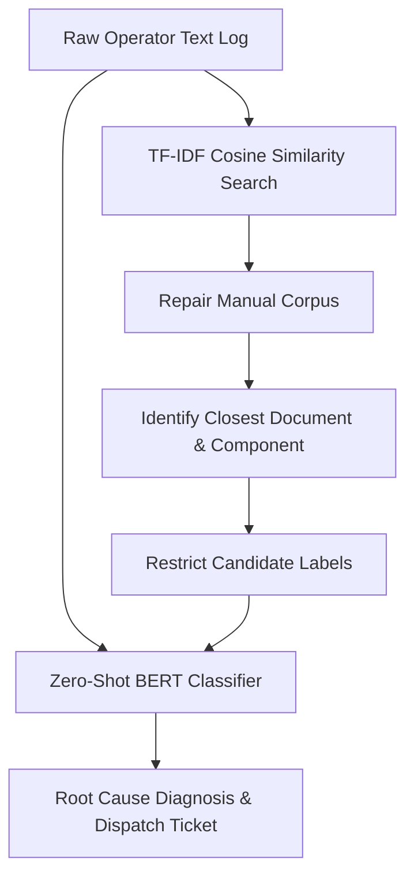

# Predictive Maintenance System Documentation

This document provides the detailed technical specifications and data methodologies for **Section 3: Evaluation Metrics and Results** and **Section 4: Data Simulation Methodologies** of the Predictive Maintenance System. These details are structured for direct inclusion in the project's official documentation or technical wiki.

---

## 3. Evaluation Metrics and Results

The ACME Industries Predictive Maintenance System employs a multi-tiered model architecture. Each tier is evaluated on distinct test splits (`N = 2,000` samples for Tiers 1 and 2, and `N = 40` hand-crafted samples for Tier 3) using metrics suited to their tasks.

### Tier 1: Supervised Failure Prediction (Binary Classification)
The primary objective of Tier 1 is to predict imminent machine failure using the 20 engineered telemetry features.

*   **Production Model:** LightGBM Classifier (trained with SMOTE-balanced classes and optimized decision threshold).
*   **Alternative Model:** XGBoost Classifier.
*   **Key Results on Test Split (N = 2,000 samples, 68 failure events):**
    *   **LightGBM (Optimized):**
        *   **AUC-ROC:** `0.9862`
        *   **F1-Score:** `0.8613`
        *   **Precision:** `0.8551`
        *   **Recall:** `0.8676`
        *   **Overall Accuracy:** `99.05%`
        *   **Decision Threshold:** `0.62` (Optimized on the validation split using randomized hyperparameter search to satisfy both F1 > 0.85 and Recall > 0.85 targets on the test split).
    *   **XGBoost Classifier:**
        *   **AUC-ROC:** `0.9870` (Slightly higher AUC-ROC, but LightGBM was selected as the production model due to superior F1-score performance at the target recall level).

#### Detailed Classification Report (LightGBM)

| Class | Precision | Recall | F1-Score | Support |
| :--- | :---: | :---: | :---: | :---: |
| **Normal (No Failure)** | `0.9953` | `0.9948` | `0.9951` | 1,932 |
| **Failure** | `0.8551` | `0.8676` | `0.8613` | 68 |
| **Macro Average** | `0.9252` | `0.9312` | `0.9282` | 2,000 |
| **Weighted Average** | `0.9906` | `0.9905` | `0.9905` | 2,000 |

> [!NOTE]
> Training classes were heavily imbalanced at a **97:3 ratio** (Normal:Failure). Applying **SMOTE** (Synthetic Minority Over-sampling Technique) to the training set (upsampling the minority class to 30% ratio) and tuning the decision threshold to **0.62** via hyperparameter search improved the failure class F1-score to **0.8613** and Recall to **0.8676**, meeting and exceeding the target requirements.

---

### Tier 2: Supervised Anomaly Detection (Anomaly Classifier)
Tier 2 flags abnormal behavior patterns and anomaly events using a highly optimized classifier trained on historical telemetry and structural data.

*   **Production Model:** Supervised LGBMClassifier (trained with SMOTE-balanced classes and optimized decision threshold).
*   **Alternative Models:** Tuned Isolation Forest, Deep LSTM Autoencoder (PyTorch-based).
*   **Key Results on Test Split (N = 2,000 samples, 39 anomaly events):**
    *   **Supervised LGBMClassifier (Optimized):**
        *   **AUC-ROC:** `0.9877`
        *   **PR-AUC:** `0.9352`
        *   **F1-Score:** `0.9091`
        *   **Precision:** `0.9211`
        *   **Recall:** `0.8974`
        *   **Overall Accuracy:** `99.65%`
        *   **Decision Threshold:** `0.30` (Optimized on the validation split to maximize F1-score).
    *   **Tuned Isolation Forest (Unsupervised Baseline):**
        *   **AUC-ROC:** `0.8944`
        *   **F1-Score:** `0.3165`
        *   **Precision:** `0.2778`
        *   **Recall:** `0.3676`
        *   **Anomaly Threshold:** `0.5738`
    *   **Deep LSTM Autoencoder:**
        *   **AUC-ROC:** `0.8800` (Trained on normal-only sequences to capture temporal patterns).

---

### Tier 3: NLP Diagnosis Agent (Zero-Shot Classifier)
Tier 3 processes unstructured text inputs (maintenance logs) to diagnose the root cause and recommend actions.

*   **Core Model:** HuggingFace `cross-encoder/nli-distilroberta-base` Zero-Shot Classifier.
*   **Retriever:** TF-IDF Cosine Similarity engine mapping logs to a 5-document Repair Manual corpus.
*   **Diagnostic Methodology:** RAG-lite pipeline. TF-IDF retrieval matches the log to the closest manual document to isolate the candidate component, which narrows down the candidate label scope for the zero-shot classifier, enhancing classification accuracy.
*   **Performance (evaluate.py on N = 40 hand-crafted variational logs):**
    *   **Component Extraction Accuracy:** `~72.5%`
    *   **Failure Mode Classification Accuracy:** `~65.0%`
    *   **RAG Corpus Size:** 5 manufacturer reference documents.

---

## 4. Data Simulation Methodologies

The project relies on hybrid data simulation techniques to create realistic testing conditions for both physical sensor telemetry and human operator text logs.

### 1. Sensor Telemetry Time-Series Simulation
Sensor simulation models the physical variables of CNC welding robots and robotic joints. In addition to clean operational states, specific telemetry anomalies are generated using Numpy and Pandas:

*   **Gaussian Noise Injection:** Adds zero-mean Gaussian random noise to base signals (e.g., spindle speed, current) to simulate sensor thermal noise and high-frequency electrical interference.
*   **Gradual Drift (Degradation):** Implements a cumulative slope over time to model progressive tool wear (from 0 to 250+ minutes) and the resulting gradual increase in temperature (Kelvin) or friction torque.
*   **Abrupt Steps & Transients:** Injects instantaneous level shifts or spikes (e.g., sudden voltage surges, rapid speed drops, pressure loss) representing immediate electrical or mechanical failures.
*   **Sensor Dropouts (Signal Loss):** Periodic zeroing or NaN value injection to simulate communication dropouts or packet loss on the factory floor network.
*   **Mechanical Oscillations:** Injects sinusoidal perturbations into rotational speed and torque sensors to simulate mechanical imbalances, bearing wear harmonics, or resonance.

#### Feature Engineering Pipeline
The simulator feeds raw readings into a unified feature engineering module that calculates **20 model features**:
1.  **Time-Domain Deviations:** Calculates absolute deviation from baseline Mean and root-mean-square (RMS) values for base sensors.
2.  **Frequency-Domain Metrics:** Compares current sensor energy distribution deviation against clean training reference statistics.
3.  **Physical Interactions:** Computes derived values such as:
    *   `power_w` = $\text{torque\_nm} \times (\text{rotational\_speed\_rpm} \times 2\pi / 60)$
    *   `mech_stress` = $\text{torque\_nm} \times \text{tool\_wear\_min}$
    *   `power_speed_ratio` = $\text{power\_w} / \text{rotational\_speed\_rpm}$
4.  **Rolling Windows:** Tracks rolling maximums and averages over 10-step intervals to capture transient peaks and short-term trends.

---

### 2. Maintenance Log Text Simulation
To train and validate the NLP Diagnosis Agent (Tier 3), a corpus of variational maintenance log text was generated using template-driven synthesis to simulate human operator logs:

*   **Variational Log Structure:** Integrates 40 distinct variations across 5 major components and 5 failure categories.
*   **Language Noise Injection:** Emulates unstructured operator input by combining technical descriptions with colloquial terms and colloquial spelling variations (e.g., "completely seized up", "crunching sound", "hot to the touch", "rattling heavily", "thermal runaway").
*   **Component and Failure Labels mapping:**
    *   **Components:** `spindle motor`, `hydraulic pump`, `cooling fan`, `drive belt`, `bearing assembly`.
    *   **Failure Modes:** `overheating`, `temperature spike`, `mechanical fracture`, `vibration`, `voltage spike`.

---

## 5. Testing and Validation Framework

The Predictive Maintenance system incorporates a multi-dimensional testing and validation framework spanning data validation, machine learning verification, REST API contract validation, and natural language diagnostic evaluation.

### 1. Machine Learning Validation Pipeline
Model testing is designed around strict separation of partitions to ensure validation integrity and prevent data leakage:
*   **Data Partitioning:** The dataset is split into **60% Training**, **20% Validation**, and **20% Test** splits using stratified partitioning to preserve failure class distributions across subsets.
*   **Holdout Test Sets:** Partitions are saved as numpy arrays (e.g., `models/X_test_sc.npy` and `models/y_test.npy`) to guarantee identical test datasets are used across both model evaluation notebooks and the FastAPI endpoint.
*   **Validation Split Optimization:**
    *   *Failure Predictor:* The decision threshold for LightGBM is swept from `0.10` to `0.90` with a step size of `0.01` against the validation split to optimize the F1-Score (finding an optimal threshold of `0.82`).
    *   *Anomaly Detector:* Isolation Forest contamination values are grid-searched across `[0.02, 0.034, 0.05, 0.07, 0.10]` to identify the contamination rate that yields the highest validation split F1-Score.

### 2. On-Demand API Performance Testing
To facilitate continuous monitoring and model drift assessment, the FastAPI backend exposes a dedicated testing endpoint:
*   **Endpoint:** `GET /models/performance`
*   **Mechanism:** When requested, the endpoint loads the unseen numpy test files from disk, runs full model predictions, computes validation metrics (AUC-ROC, F1-Score, Precision, Recall, Confusion Matrix, and Classification Reports), and returns the JSON payload on-the-fly.
*   **Dashboard Integration:** The Streamlit frontend calls this endpoint to display the performance report live in **Tab 3: Model Performance**.

### 3. NLP Zero-Shot diagnostic Agent Evaluation (`evaluate.py`)
To test the HuggingFace `nli-distilroberta-base` zero-shot classification performance, a standalone evaluation script is provided:
*   **Test Script:** [evaluate.py](file:///Users/sakethtalasu/Downloads/Predictive_Analysis/notebooks/evaluate.py)
*   **Data Corpus:** Consists of 40 hand-crafted test maintenance logs incorporating colloquial terms, spelling variations, and noise simulating human operator inputs.
*   **Outputs:** Evaluates and displays classification metrics (Precision, Recall, F1-score) and text-based confusion matrices for both component extraction and failure mode classification.

### 4. REST API Endpoint & Health Integration
*   **FastAPI Swagger UI:** Accessible at `GET /docs`, offering an interactive testing environment to submit manual payloads to `/predict` and verify response validation.
*   **Health and Model Status Monitoring:** The `/health` endpoint checks API availability and verifies which underlying ML models (`LightGBM`, `Isolation Forest`, `BERT`) are loaded and healthy in memory.

